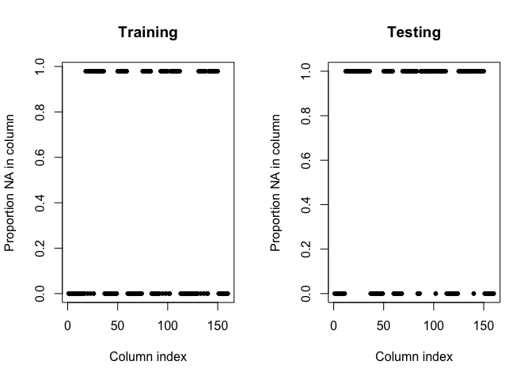

PracticalMachineLearningReport
================

## Background

Using devices such as Jawbone Up, Nike FuelBand, and Fitbit it is now
possible to collect a large amount of data about personal activity
relatively inexpensively. These type of devices are part of the
quantified self movement – a group of enthusiasts who take measurements
about themselves regularly to improve their health, to find patterns in
their behavior, or because they are tech geeks. One thing that people
regularly do is quantify how much of a particular activity they do, but
they rarely quantify how well they do it. In this project, your goal
will be to use data from accelerometers on the belt, forearm, arm, and
dumbell of 6 participants. They were asked to perform barbell lifts
correctly and incorrectly in 5 different ways. More information is
available from the website here:
<http://web.archive.org/web/20161224072740/http:/groupware.les.inf.puc-rio.br/har>
(see the section on the Weight Lifting Exercise Dataset).

The training data for this project are available here:
<https://d396qusza40orc.cloudfront.net/predmachlearn/pml-training.csv>

The test data are available here:
<https://d396qusza40orc.cloudfront.net/predmachlearn/pml-testing.csv>

The data for this project come from this source:
<http://web.archive.org/web/20161224072740/http:/groupware.les.inf.puc-rio.br/har>.
If you use the document you create for this class for any purpose please
cite them as they have been very generous in allowing their data to be
used for this kind of assignment.

## Data preparatation

Download test and training data if not already existing and load the
downloaded csv
files.

``` r
url_training_data <- "https://d396qusza40orc.cloudfront.net/predmachlearn/pml-training.csv"
url_testing_data <- "https://d396qusza40orc.cloudfront.net/predmachlearn/pml-testing.csv"

path_training_data <- "./data/pml-training.csv"
path_testing_data <- "./data/pml-testing.csv"

if(!file.exists(path_training_data)){
        download.file(url_training_data, path_training_data)
}
if(!file.exists(path_training_data)){
        download.file(url_testing_data, path_testing_data)
}

training <- read.csv(path_training_data)
testing <- read.csv(path_testing_data)
```

Perform some simple exploratory analysis on the data set

``` r
dim(training)
```

    ## [1] 19622   160

``` r
dim(testing)
```

    ## [1]  20 160

There are NA values in both training and testing data. Investigate how
often a column in training and testing is NA.

``` r
par(mfrow=c(1,2))
plot(sapply(training, function(y) sum(is.na(y))/length(y)), pch = 20, xlab = "Column index", ylab = "Proportion NA in column", main = "Training")
plot(sapply(testing, function(y) sum(is.na(y))/length(y)), pch = 20, xlab = "Column index", ylab = "Proportion NA in column", main = "Testing")
```

<!-- -->

A column in training and test is either fully complete or only NAs. We
can therefore exclude any columns that have NAs in either training or
test.

``` r
features_no_na_training <- sapply(training, function(y) !any(is.na(y)))
features_no_na_testing <- sapply(testing, function(y) !any(is.na(y)))
features_no_na <- features_no_na_training & features_no_na_testing

training <- training[, features_no_na]
testing <- testing[, features_no_na]
```

Remove columns not applicable, name of user, timestamps related
variables and window.

``` r
training <- training[, -(1:7)]
testing <- testing[, -(1:7)]
dim(training)
```

    ## [1] 19622    53

``` r
dim(testing)
```

    ## [1] 20 53

The final data frame contains 52 predictors and 1 outcome (classe).

## Data analysis

Load required library and set seed for reproducability. Split the
training in a 75% training set and a 25% valiation set.

``` r
library(ggplot2)
library(lattice)
library(caret)
set.seed(32123)

inTrain = createDataPartition(training$classe, p = 3/4)[[1]]
training = training[ inTrain,]
validating = training[-inTrain,]
```

Use a 3 folded cross valiation and train a random forest with default
parameters.

``` r
fitControl <- trainControl(method = "cv", number = 3)
mdl_rf <- train(classe ~ ., data = training, method = "rf", trControl = fitControl)
```

Verify random forest model on valiadtion data

``` r
pred_validating <- predict(mdl_rf, newdata = validating)
confusionMatrix(pred_validating, validating$classe)
```

    ## Confusion Matrix and Statistics
    ## 
    ##           Reference
    ## Prediction    A    B    C    D    E
    ##          A 1059    0    0    0    0
    ##          B    0  698    0    0    0
    ##          C    0    0  636    0    0
    ##          D    0    0    0  598    0
    ##          E    0    0    0    0  680
    ## 
    ## Overall Statistics
    ##                                     
    ##                Accuracy : 1         
    ##                  95% CI : (0.999, 1)
    ##     No Information Rate : 0.2885    
    ##     P-Value [Acc > NIR] : < 2.2e-16 
    ##                                     
    ##                   Kappa : 1         
    ##                                     
    ##  Mcnemar's Test P-Value : NA        
    ## 
    ## Statistics by Class:
    ## 
    ##                      Class: A Class: B Class: C Class: D Class: E
    ## Sensitivity            1.0000   1.0000   1.0000   1.0000   1.0000
    ## Specificity            1.0000   1.0000   1.0000   1.0000   1.0000
    ## Pos Pred Value         1.0000   1.0000   1.0000   1.0000   1.0000
    ## Neg Pred Value         1.0000   1.0000   1.0000   1.0000   1.0000
    ## Prevalence             0.2885   0.1901   0.1732   0.1629   0.1852
    ## Detection Rate         0.2885   0.1901   0.1732   0.1629   0.1852
    ## Detection Prevalence   0.2885   0.1901   0.1732   0.1629   0.1852
    ## Balanced Accuracy      1.0000   1.0000   1.0000   1.0000   1.0000

The model is performing well on the validation data. Let’s use the
trained random forest model on the testing data.

``` r
predict(mdl_rf, newdata = testing)
```

    ##  [1] B A B A A E D B A A B C B A E E A B B B
    ## Levels: A B C D E
